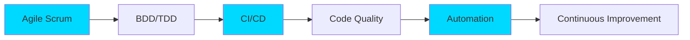

<div align="center">
  
</div>

<div align="center">
  
</div>

## 🚀 About Me

```typescript
const anass = {
    location: "Rabat, Morocco 🇲🇦",
    currentRole: "QA Automation Engineer @ JumpIT",
    education: "UM6P / Youcode - Java/Angular Development",
    passions: ["Clean Code", "Test Automation", "Microservices", "DevOps"],
    currentFocus: "Building robust applications & ensuring software quality",
    languages: {
        french: "A2",
        english: "B1", 
        arabic: "Native"
    },
    lifePhilosophy: "Code with purpose, test with precision 🎯"
};
```

<div align="center">
  
### 💼 Professional Journey
  
| 🔄 Role | 🏢 Company | 📅 Period |
|---------|-----------|-----------|
| **QA Automation Engineer** | JumpIT (Consultant) | Jul 2025 - Present |
| **Full Stack Developer** | Alef Digital Solutions | May 2024 - Aug 2024 |

</div>

---

## 🛠️ Tech Stack & Tools

<div align="center">

### 💻 Languages


### 🎨 Frontend


### ⚙️ Backend


### 🗄️ Databases


### 🧪 Testing & QA


### 🔧 DevOps & Tools


</div>

---

## 🌟 Featured Projects

<div align="center">

<table>
<tr>
<td width="50%">

### 🎮 GameHub-Pro
**Gaming Club Management Platform**

```yaml
Architecture: Microservices
Technologies:
  - Spring Boot & Security
  - Angular + Tailwind CSS
  - PostgreSQL + Elasticsearch
  - Docker + CI/CD
Features:
  - Intelligent equipment reservation
  - RESTful API architecture
  - Real-time availability tracking
```

[](https://github.com/Anassaitouaguerd/Gaming-Club)

</td>
<td width="50%">

### 🏦 NexaBank
**Online Banking Management System**

```yaml
Architecture: RESTful Modular
Technologies:
  - Spring Boot & Security
  - Angular
  - PostgreSQL + Elasticsearch
  - Jenkins CI/CD
Features:
  - Secure transaction processing
  - Account management
  - Real-time balance tracking
```

[](https://github.com/Anassaitouaguerd/NexaBank)

</td>
</tr>

<tr>
<td colspan="2">

### 📚 IMasteryLab
**E-Learning Platform**

```yaml
Type: Full Stack Web Application
Duration: 3 months
Technologies:
  - React.js + Responsive Design
  - Laravel + RESTful API
  - MySQL
Features:
  - Course enrollment system
  - Progress tracking
  - Educational content management
  - User authentication & authorization
```

</td>
</tr>
</table>

</div>

---

## 📊 GitHub Stats

<div align="center">
  
  
</div>

<div align="center">
  
</div>

<div align="center">
  
</div>

---

## 💼 Current Focus @ JumpIT

<div align="center">

### 🎯 QA Automation Projects

| 🏢 Client | 🎯 Focus Areas | 🛠️ Tech Stack |
|-----------|---------------|---------------|
| **Groupe Barrière** <br/> *(Poker, Casinos, Hotels)* | • E2E & UI Test Automation<br/>• Non-Regression Testing<br/>• CI/CD Integration | Playwright, TypeScript<br/>GitLab CI, Agile Scrum |
| **Voyage Privé Group** <br/> *(Luxury Travel E-commerce)* | • BDD Test Scenarios<br/>• Critical Path Automation<br/>• Test Campaign Management | Playwright, Cucumber<br/>XRAY, GitLab CI |

</div>

---

## 🎓 Methodologies & Best Practices

<div align="center">



</div>

<div align="center">

| 🔄 Methodology | 📋 Practices |
|----------------|-------------|
| **Agile Scrum** | Daily standups, Sprint planning, Retrospectives |
| **BDD** | Gherkin scenarios, 3 Amigos sessions, Living documentation |
| **TDD** | Unit testing, Integration testing, Test coverage |
| **CI/CD** | Automated pipelines, Continuous testing, GitLab CI |

</div>

---

## 🏆 Achievements & Contributions

<div align="center">

```diff
+ Automated 100+ test scenarios for high-traffic e-commerce platforms
+ Implemented CI/CD pipelines reducing testing time by 60%
+ Developed microservices architecture applications with Spring Boot
+ Created responsive web applications with modern frameworks
+ Contributed to quality assurance best practices in cross-functional teams
```

</div>

---

## 📫 Let's Connect!

<div align="center">

[](https://www.linkedin.com/in/yourprofile)
[](https://github.com/YourGitHubUsername)
[](mailto:aitouaguerdanass@gmail.com)
[](https://yourportfolio.com)

</div>

---

<div align="center">
  
### 💡 Currently Learning & Exploring


</div>

---

<div align="center">
  
</div>

<div align="center">
  
### ⚡ Fun Fact
  
*"I debug in my sleep and dream in code! When I'm not automating tests, I'm probably thinking about how to automate more tests 😄"*

</div>

<div align="center">
  
**⭐ From [Anassaitouaguerdd](https://github.com/Anassaitouaguerdd) with ❤️**

</div>
